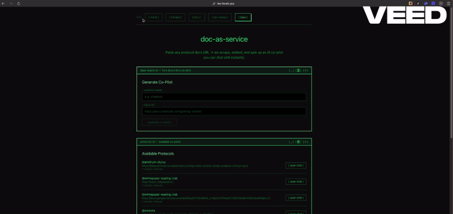

# Pham Nim | Web3 Developer Relations & Blockchain Engineer

  
  
  
  
  

## 🚀 About Me

Passionate **Web3 Developer Relations** professional and **Blockchain Engineer** with expertise in DeFi protocols, smart contract development, and cross-chain solutions. I bridge the gap between complex blockchain technology and developer communities through clear documentation, educational content, and innovative dApp development.

## 🔧 Core Expertise

### Blockchain Development
- **Smart Contracts**: Solidity, Move, Rust (Stylus)
- **DeFi Protocols**: Lending, DEXs, Yield Farming, Asset Management
- **Cross-Chain Solutions**: Multi-chain integrations and bridges
- **Layer 2**: Arbitrum, Optimism, XRPL

### Technologies & Tools
- **Frontend**: React, TypeScript, Next.js
- **Backend**: Node.js, Express, PostgreSQL
- **Blockchain SDKs**: Ethers.js, Web3.js, Viem
- **Development Frameworks**: Hardhat, Foundry, Truffle

### DevRel & Community
- Technical documentation and tutorials
- Developer workshops and training
- Open-source contribution and maintenance
- Community engagement and support

## 🌟 Strategic Contributions

### 🧠 Document-as-a-Service (DaaS) & AI Co-Pilots for Web3
**Projects:** [**Leo Playbook (Nim Blog)**](https://github.com/phamdat721101/nim-blog) & [**The Valley (OverGuild)**](https://www.the-valley.xyz/)
> *Transforming static Web3 protocol documentation into interactive, autonomous AI-powered services in seconds.*

- 📚 **Document-as-a-Service**: Architected a robust ingestion pipeline using **FastAPI**, **Gemini Embeddings**, and **pgvector (Supabase)** to scrape, embed, and autonomously spin up AI co-pilots from any protocol documentation URL.
- 🤖 **Agentic Chat & Playground**: Built interactive AI playgrounds with real-time vector similarity search to assist developers with protocol-specific code examples, integration patterns, and smart contract design.
- 🌌 **The Archive & The Academy**: Integrated these DaaS capabilities into "The Valley" (OverGuild's gamified platform) as "The Archive" and "The Academy", creating a personalized AI mentor to teach DeFi and Web3.
- 🖼️ **Proof of Work - DaaS in Action**:
  

    
     
    <em>Leo-book Document-as-a-Service Ingestion & Chat Playground</em>
  

### 🛠️ Support Web3 Builders with Agentic AI
**Project:** [**Builder Skills**](https://github.com/phamdat721101/builder-skills)
> *Building the brain for the next generation of AI Agents to assist Web3 Developers.*

- 🤖 **Agent Skill Sets**: Developing core skills for AI agents to autonomously debug, write, and deploy smart contracts.
- 📚 **Multi-Chain Education**: Supporting learning paths for **Solidity** (Ethereum), **Rust** (Arbitrum Stylus), and **Move**.
- 🔗 **Related Protocols**: `Ethereum`, `Arbitrum`, `XRPL`

### 📊 EVM Data Aggregator for XRPL
**Project:** [**Trackit**](https://github.com/phamdat721101/trackit)
> *Unlocking data accessibility for the XRPL EVM Sidechain.*

- 🔎 **Data Aggregation**: Building infrastructure to index and query EVM data on XRPL.
- 🌉 **Cross-Ecosystem Bridge**: Facilitating better data flow between XRP Ledger and EVM chains.
- 🔗 **Related Protocols**: `XRPL`, `EVM Sidechain`, `Ripple`

### 🏔️ Gamified Quest Platform
**Project:** [**The Valley**](https://www.the-valley.xyz/)
> *The premier quest platform driving growth for Web3 projects.*

- ⚔️ **Engage & Earn**: Gamified architecture to boost user retention and engagement through questing.
- 🛡️ **Community Building**: Tools for guilds and projects to launch competitive campaigns.
- 🔗 **Related Concepts**: `Gamification`, `Community Growth`, `Web3 Quests`

## 🏆 Featured Projects

### [📊 DeFi Service](https://github.com/phamdat721101/defi-service)
*Comprehensive DeFi protocol management system with TypeScript and Move integration*
- Built scalable DeFi service architecture
- Implemented cross-chain asset management
- Real-time price feeds and analytics

### [₿ BTCFi with Stylus](https://github.com/phamdat721101/btc-stylus)
*Learning Arbitrum Stylus & BTCFi Use Cases*
- Rust smart contract development
- Bitcoin DeFi integration
- Educational content for developers

## 📚 Recent Contributions & Learning

### Blockchain Education
- **Stylus Development**: Active exploration of Arbitrum Stylus for Rust smart contracts
- **Move Language**: Contributing to Move ecosystem projects
- **Creditcoin RWA**: Building Real World Asset integration examples
- **BTCFi**: Bitcoin DeFi protocols and cross-chain solutions

### Open Source
- Maintainer of multiple Web3 repositories
- Contributor to blockchain developer tools
- Educational content creator

## 🌐 Community & Socials

### 📢 Stay Updated & Connect
I actively engage with the community and share insights on Web3 development.

- 🐦 **Personal Updates**: [**@nxNim9**](https://x.com/nxNim9)
    > *Daily insights on Web3, DevRel, and Engineering.*
- 🏟️ **OverGuild Community**: [**@overguildOG**](https://x.com/overguildOG)
    > *Empowering guilds and players in the Web3 gaming space.*

**Interested in collaboration or need help with your Web3 project? Feel free to reach out via [Twitter/X](https://x.com/nxNim9)!**

---

  <strong>"Empowering developers to build the decentralized future"</strong>

  

  

